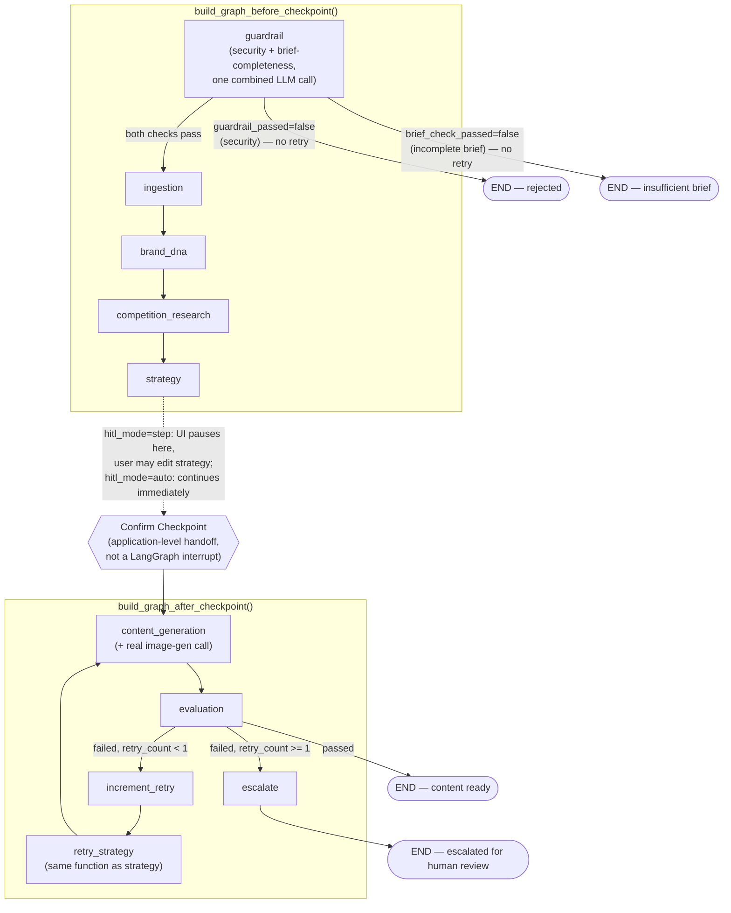

# Architecture — LangGraph State & Graph

Source of truth: `backend/pipeline_graph.py`. This doc mirrors the code
exactly (verified against it, not written from memory) — if they ever
diverge, the code wins and this doc is stale.

## AgentState

A single `TypedDict` threaded through every node. Each node returns a
partial dict; LangGraph merges it into the running state (last write
wins per key, no reducers — every field is owned by exactly one node
at a time, so this is safe).

| Field | Type | Set by | Notes |
|---|---|---|---|
| `raw_input` | `str` | caller (initial state) | The user's brief, verbatim |
| `session_assets` | `dict` | caller (initial state) | `{"brand_guidelines": str, "competitor_refs": str}` — already-processed text (images/video pre-converted to descriptions by `backend/uploads.py` before the graph ever runs) |
| `hitl_mode` | `str` | caller (initial state) | `"auto"` or `"step"` — read by the UI, not by any node |
| `guardrail_passed` | `bool` | `guardrail_node` | Security check (injection/scope) |
| `guardrail_reason` | `str` | `guardrail_node` | |
| `brief_check_passed` | `bool` | `guardrail_node` | Completeness check (brand name/objective/audience present) — same node, same LLM call as the security check |
| `brief_check_reason` | `str` | `guardrail_node` | |
| `brand_name` | `str` | `guardrail_node` | Extracted brand/product name; threaded into every downstream prompt as an explicit "who am I writing for" anchor (see Findings in `evals/README.md` for why this exists) |
| `ingestion_source` | `str` | `ingestion_node` | `"session"` or `"none"` — static-library routing is unbuilt (M6 stretch), so this never resolves to `"library"` today |
| `brand_profile` | `dict` | `brand_dna_node` | `{"voice", "pillars", "visual_style", "rationale"}` |
| `competition_insights` | `dict` | `competition_research_node` | `{"techniques", "gap", "rationale"}` |
| `strategy` | `dict` | `strategy_node` (and `retry_strategy`, same function) | `{"big_idea", "message_architecture", "rationale"}` — this is what the step-mode checkpoint shows and lets the user edit |
| `content` | `dict` | `content_generation_node` | `{"reference_image": {"prompt_used", "image_path"}, "motion_prompt", "style_tags", "instagram", "tiktok"}` — `image_path` only present in real mode (local temp file from `backend/vision.generate_image`) |
| `eval_result` | `dict` | `evaluation_node` | `{"passed", "brand_alignment", "harmful_content_flag", "reason"}` |
| `retry_count` | `int` | `increment_retry_node` | Capped at `MAX_RETRIES = 1` |
| `escalated` | `bool` | `escalate_node` | True only after a 2nd evaluation failure |

## Graph structure

The pipeline is compiled as **two separate `StateGraph` objects**, not
one — this is how the human confirm checkpoint (Strategy review) works
*without* using LangGraph's `interrupt()`/resume machinery. The UI runs
them as two separate Python calls, handing off the same state dict in
between. See `docs/tasks.md` M2 for why this was the deliberate choice
over a real `interrupt()` (tracked as an M6 stretch item).

### Why two graphs instead of one

The retry loop (`increment_retry` → `retry_strategy` → `content_generation`)
lives entirely inside `build_graph_after_checkpoint`. That's deliberate:
a retry re-running Strategy does **not** re-trigger the human checkpoint
— the checkpoint only ever pauses once, on the first pass through
Strategy, before Content Generation has run at all. `retry_strategy` is
the same Python function as `strategy_node`, just registered as a
second node under a different name so it can live inside the second
graph without duplicating logic.

### Checkpointing

Both graphs are compiled with `MemorySaver()` — in-memory only, wiped
on process restart. This is explicitly a demo-scope choice (CLAUDE.md
§9 names a persistent Postgres checkpointer as future work). Note this
is *not* what carries the state between the two graphs, though — that
handoff is a plain Python dict passed by the caller (`frontend/app.py`
or `backend.pipeline_graph.run()`), not a checkpointer resume. Each
graph's own `MemorySaver` only tracks steps *within* that graph's own
single `.invoke()`/`.stream()` call.

## Node responsibilities

| Node | Reads | Answers |
|---|---|---|
| `guardrail` | `raw_input` | Is this safe/in-scope, and does it name a brand, objective, and audience? |
| `ingestion` | `session_assets` | Where does brand context come from — session upload or nothing? |
| `brand_dna` | `session_assets.brand_guidelines` | What does this brand consistently say about itself? |
| `competition_research` | `session_assets.competitor_refs` | What creative techniques are competitors using? |
| `strategy` | `brand_profile`, `competition_insights`, `raw_input`, `brand_name` | One big idea + message architecture — not five options |
| `content_generation` | `strategy`, `brand_profile`, `brand_name` | Channel-ready copy + one shared visual concept (image prompt, generated image, motion prompt) |
| `evaluation` | `content`, `brand_profile`, `competition_insights`, `brand_name` | Is this on-brand, harmless, and correctly attributed (not to a competitor)? |

## Mock mode

Every node checks `USE_MOCK` (env var, read once at import) before
doing any real work. Mock branches return fixed canned output and
never call `call_llm`/vision/image-gen — the entire graph, including
both retry and escalate branches, is fully exercisable with zero
network access and zero cost. See `docs/tasks.md` §11 origin and
`evals/README.md` for how this is used to keep the control-flow
examples deterministic.
